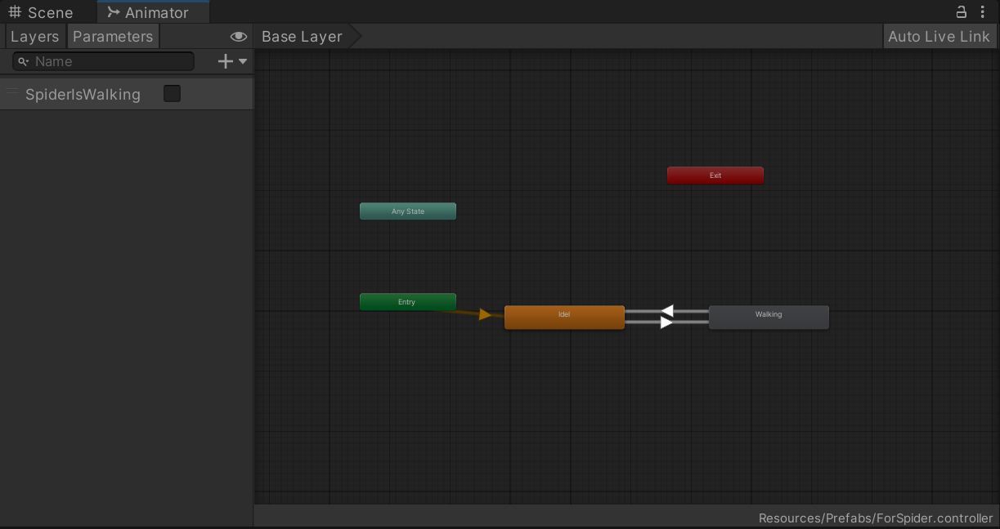
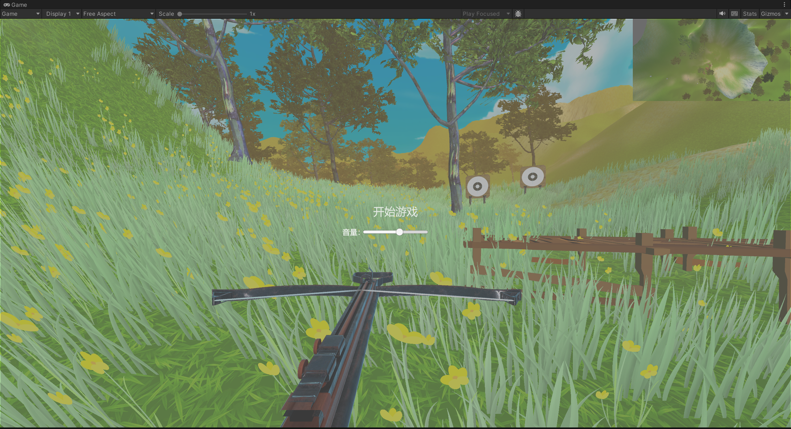

### 一、简介

使用unity完成一个第一人称射箭打靶游戏

评分标准

总分共 26 分或更多 ：

-  基础分（2分）：有博客；
-  1-3分钟视频（2分）：视频呈现游戏主要游玩过程；
- 游戏场景（14分）
  -  地形（2分）：使用**地形组件**，上面有**山、路、草、树**；（可使用第三方资源改造）
  -  天空盒（2分）：使用**天空盒**，天空可随 玩家位置 或 时间变化 或 按特定按键**切换天空盒**；
  -  固定靶（2分）：使用**静态物体**，有一个以上固定的靶标；（注：射中后状态不会变化）
  -  运动靶（2分）：使用**动画运动**，有一个以上运动靶标，运动轨迹，速度使用动画控制；（注：射中后需要有效果或自然落下）
  -  射击位（2分）：地图上应标记若干射击位，仅在射击位附近或区域可以拉弓射击，每个位置有 n 次机会；
  -  摄像机（2分）：使用**多摄像机**，制作 鸟瞰图 或 瞄准镜图 使得游戏更加易于操控；
  -  声音（2分）：使用**声音组件**，播放背景音 与 箭射出的声效；
- 运动与物理与动画（8分）
  -  游走（2分）：使用**第一人称组件**，玩家的驽弓可在地图上游走，不能碰上树和靶标等障碍；（注：建议使用 [unity 官方案例](https://assetstore.unity.com/packages/essentials/starter-assets-firstperson-updates-in-new-charactercontroller-pa-196525)）
  -  射击效果（2分）：使用 **物理引擎** 或 **动画** 或 **粒子**，运动靶被射中后产生适当效果。
  -  碰撞与计分（2分）：使用 **计分类** 管理规则，在射击位射中靶标得相应分数，规则自定；（注：应具有现场修改游戏规则能力）
  -  驽弓动画（2分）：使用 **动画机** 与 **动画融合**, 实现十字驽蓄力**半拉弓**，然后 **hold**，择机 **shoot**；
- 游戏与创新（不限项，每项 2 分）
  -  场景与道具类: 有趣的事物 或 模型等 （可以模仿 Unity 官方案例，在地形基础上搭建几何型场地）
  -  效果类：如显示箭的轨迹，特殊声效，等
  -  力场类: 如运用力场实现 ai 导航 与 捕获等
  -  游戏感: 这是一个模糊的指标，有游戏感也许是某些人的天赋。

### 二、实现

#### 基础分（2分）：有博客；√

#### 1-3分钟视频（2分）：视频呈现游戏主要游玩过程；√

#### 游戏场景（14分）

- 地形（2分）：使用**地形组件**，上面有**山、路、草、树**；（可使用第三方资源改造）；√

​		以“Fantasy Skybox FREE”里的“Demo with terrain“为基础，利用terrain组件进行了包括拉高/低地形、绘制		贴图、绘制树、绘制草的操作，使得地形更加符合游戏设定。

- 天空盒（2分）：使用**天空盒**，天空可随 玩家位置 或 时间变化 或 按特定按键**切换天空盒**；√

​		以”Fantasy Skybox FREE“提供的天空盒为基础，单独设计一个脚本实现”按t键切换天空盒，并改变光照模拟		更真实的天空切换“。

```c#


    private void AdjustLightingBasedOnWeather()
    {
        // 根据不同天气调整光源的强度和颜色，更真实
        switch (currentSkyboxIndex)
        {
            case 0: // Sunny
                RenderSettings.skybox = sunnySkybox;
                GetComponent<Light>().intensity = 1.0f;
                GetComponent<Light>().color = Color.white; // 白色光
                break;

            case 1: // Rainy
                RenderSettings.skybox = rainySkybox;
                GetComponent<Light>().intensity = 0.6f;
                GetComponent<Light>().color = new Color(0.7f, 0.7f, 0.7f); // 灰色光，模拟阴天
                break;

            case 2: // Snowy
                RenderSettings.skybox = snowySkybox;
                GetComponent<Light>().intensity = 0.8f;
                GetComponent<Light>().color = new Color(0.9f, 0.9f, 0.9f); // 亮白光
                break;

            case 3: // Cloudy
                RenderSettings.skybox = cloudySkybox;
                GetComponent<Light>().intensity = 0.7f;
                GetComponent<Light>().color = new Color(0.8f, 0.8f, 0.8f); // 朦胧白光
                break;
        }
    }


```


- 固定靶（2分）：使用**静态物体**，有一个以上固定的靶标；（注：射中后状态不会变化）；√

​		以”Military target“资源提供的靶子预制件为基础，提前把靶子固定在场景中的特定位置。

- 运动靶（2分）：使用**动画运动**，有一个以上运动靶标，运动轨迹，速度使用动画控制；（注：射中后需要有效果或自然落下）；√

  以”model“文件夹中的”SPIDER BOT“模型充当运动靶，借助动画状态机控制动画状态，使用脚本控制其移动与击中后动画播放与计分。

  

  ```c#
  //展示部分代码
  
      private void OnCollisionEnter(Collision collision)
      {
          // 检测到箭矢碰撞
          if (collision.gameObject.CompareTag("Arrow"))
          {
              audioSource.Play();//播放声音
              // 播放爆炸效果
              if (explosionEffect != null)
              {
                  Instantiate(explosionEffect, transform.position, Quaternion.identity);
              }
              gameUI.UpdateScore(50);//计分
              // 销毁蜘蛛
              StartCoroutine(DestroySpiderAfterDelay(1f)); // 延迟1秒销毁蜘蛛，否则爆炸动画播放会报错。
              
          }
      }
  
  
  ```

  

- 射击位（2分）：地图上应标记若干射击位，仅在射击位附近或区域可以拉弓射击，每个位置有 n 次机会；×

- 摄像机（2分）：使用**多摄像机**，制作 鸟瞰图 或 瞄准镜图 使得游戏更加易于操控；√

  使用了2台摄像机，其中一台提供第一人称视角；另一台在右上角提供俯瞰视角。


- 声音（2分)：使用**声音组件**，播放背景音 与 箭射出的声效；√

​		实现的声音包括拉弓的声音，箭射出的声音，箭击中物体的声音，动态靶被击中后爆炸的声音以及游戏背景音乐。其中背景音乐来自《文明6》罗马帝国（我很喜欢）

​		get到”AudioSource“组件之后调用Play（）方法即可，非常简单。记得调整好”Play on Wake“和”Loop“参数。


#### 运动与物理与动画（8分）

- 游走（2分）：使用**第一人称组件**，玩家的驽弓可在地图上游走，不能碰上树和靶标等障碍；（注：建议使用 [unity 官方案例](https://assetstore.unity.com/packages/essentials/starter-assets-firstperson-updates-in-new-charactercontroller-pa-196525)）√

  第一人称组件的实现有两个脚本，一个控制第一人称摄像机；另一个控制角色移动。通过设置collider和characterController组件实现了玩家的弩弓不与物体穿模。

  ```c#
  //控制角色移动
      private void Update()
      {
          isGround = Physics.CheckSphere(groundCheck.position,checkRedius,groundLayer);
          if(isGround && velocity.y < 0)
          {
              velocity.y = -2f;
          }
          horizontalMove = Input.GetAxis("Horizontal") * moveSpeed;
          verticalMove = Input.GetAxis("Vertical") * moveSpeed;
          dir = transform.forward * verticalMove + transform.right * horizontalMove;
          cc.Move(dir * Time.deltaTime);
          //我们需要获取到跳跃按键的事件，使用Input中的GetButtonDown()方法，他会返回一个布尔值，当按下时才会返回真
          //Jump可以在InputManager中查看
          //在一瞬间有一个向上的速度，在过程中也会随着重力慢慢下降，如果想要让它只跳跃一次的话，加上isGround就行了
          if(Input.GetButtonDown("Jump") && isGround)
          {
              velocity.y = jumpSpeed;
          }
          velocity.y -= gravity * Time.deltaTime;//这样每秒它就会减去重力的值不断下降
          //再用CharacterController的Move方法来移动y轴
          cc.Move(velocity * Time.deltaTime);
      }
  ```

  

  ```c#
  //控制摄像机视角随鼠标移动
  private void Update()
      {
          //在Update方法中，我们使用输入系统中的GetAxis方法来获取鼠标移动的值，乘以鼠标灵敏度再乘以Time.deltatime,鼠标移动的值就这样得到了
          //Input.GetAxis:它会在鼠标移动相应对应轴的过程中返回 -1 到 1 的值
          mouseX = Input.GetAxis("Mouse X") * mouseSensitivity * Time.deltaTime;
          mouseY = Input.GetAxis("Mouse Y") * mouseSensitivity * Time.deltaTime;
          xRotation -= mouseY;
          //使用数学函数Clamp限制
          xRotation = Mathf.Clamp(xRotation,-70f,70f);
          //这里使用Transform的Rotate()方法来旋转player
          //Vector3.up是向上的一个三维变量，和一个0，1，0的三维变量是一样的
          //我们需要控制player的y轴旋转才能让它左右旋转
          player.Rotate(Vector3.up * mouseX);
          //接下来我们要选转相机了，我们使用tranform.localRotation方法，让相机上下旋转，使用localRotation就可以不被父对象旋转影响，造成一些奇怪的问题
          //因为localRotation是属性，我们还要给他赋值
          transform.localRotation = Quaternion.Euler(xRotation, 0, 0);
      }
  ```

  

- 射击效果（2分）：使用 **物理引擎** 或 **动画** 或 **粒子**，运动靶被射中后产生适当效果；√

  

  

  ```c#
  // 播放爆炸效果
              if (explosionEffect != null)
              {
                  Instantiate(explosionEffect, transform.position, Quaternion.identity);
              }
  ```

  

- 碰撞与计分（2分）：使用 **计分类** 管理规则，在射击位射中靶标得相应分数，规则自定；（注：应具有现场修改游戏规则能力）√

  实现了根据靶子与射击角色距离计分的规则，对于动态靶子则是固定分值

  ```c#
  //根据距离算分    
  private void OnCollisionEnter(Collision collision)
      {
          // 检查是否与箭发生碰撞
          if (collision.gameObject.CompareTag("Arrow"))
          {
              // 计算靶子与主角的距离
              float distance = Vector3.Distance(transform.position, player.transform.position);
  
              // 根据距离计算得分
              int score = CalculateScore(distance);
              gameUI.UpdateScore(score);
              // 显示得分信息（可替换为实际的 UI 更新逻辑）
              Debug.Log($"Hit! Distance: {distance:F2}, Score: {score}"); 
          }
      }
      private int CalculateScore(float distance)
      {
          // 如果距离超过最大距离，返回最大得分
          if (distance >= maxDistance)
              return maxScore;
          // 如果距离小于等于 0，返回最低得分
          if (distance <= 10)
              return minScore;
  
          // 按距离线性插值计算得分
          float t = Mathf.Clamp01(distance / maxDistance);
          return Mathf.RoundToInt(Mathf.Lerp(minScore, maxScore, t));
      }
  ```

  

- 驽弓动画（2分）：使用 **动画机** 与 **动画融合**, 实现十字驽蓄力**半拉弓**，然后 **hold**，择机 **shoot**；√

  

#### 游戏与创新（不限项，每项 2 分）

- 场景与道具类: 有趣的事物 或 模型等 （可以模仿 Unity 官方案例，在地形基础上搭建几何型场地）√

  靶子，房子，跳动的蜘蛛。

  

- 效果类：如显示箭的轨迹，特殊声效，等；√

  声音在前面讲过了，在这里补充箭的轨迹。

  

- 力场类: 如运用力场实现 ai 导航 与 捕获等；×

- 游戏感: 这是一个模糊的指标，有游戏感也许是某些人的天赋；√

  整体虽然简单，但是包括音效，地形，UI等，总体产生很舒服的感觉。

- UI：我实现了好多UI，给孩子2分吧。

  包括开始界面可以调音量，游戏界面有绑定动画曲线的力量条，以及按ESC出现暂停界面。

  

  

  

  

#### 自评总分：32分

