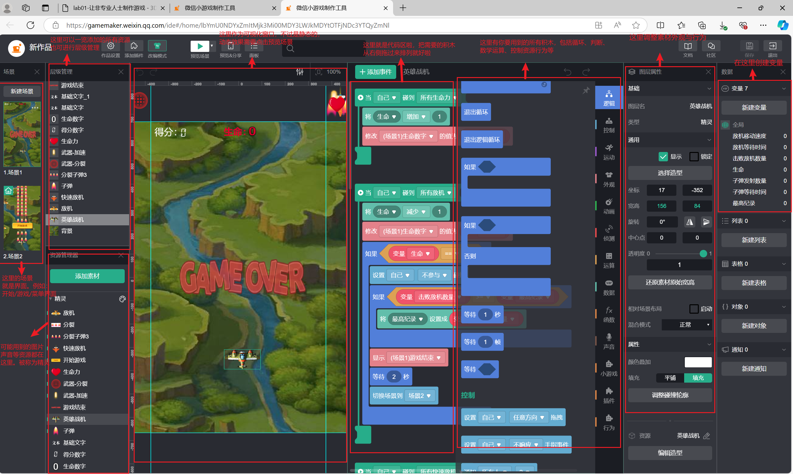
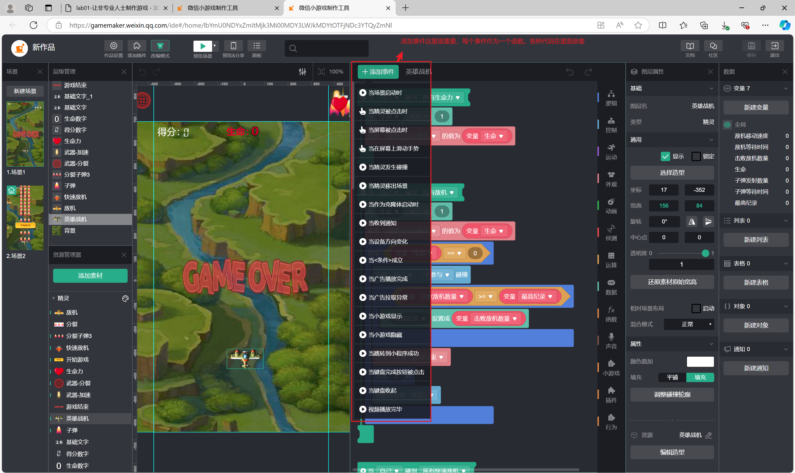
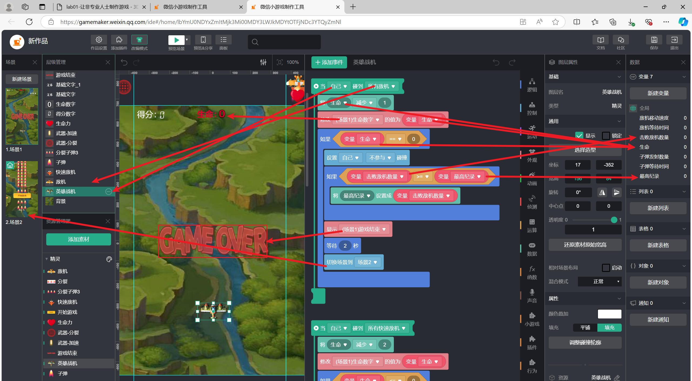
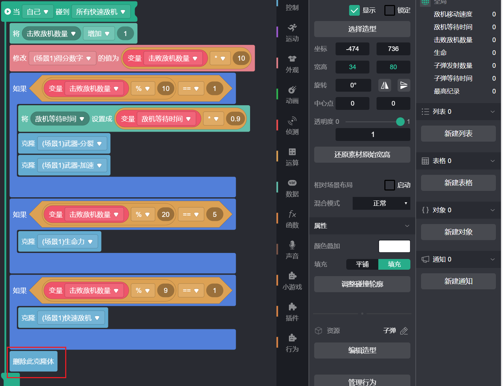

## SYSU-SSE 3D游戏编程与设计1：开发微信小游戏

> ​		这门课程的第一节课，老师甚至没有让我们安装游戏引擎。这是课上ppt的部分内容：“游戏开发必须依赖专业程序员？否，非专业人士也能制作有趣的游戏。例如，游戏设计师不需要高深的编程知识，也能使用现代的工具制作可玩的原型游戏或在线游戏。甚至中学生也是创作者，用游戏释放创意…”。

#### 1、实验目的：

- 了解面向非专业人士、少儿的可视化游戏编程工具与技术
- 创作一款小游戏，体验制作游戏的过程，总结该过程中经常遇到的专业和技术概念
- 尝试编写技术博客分享你的经验

#### 2、实验/学习工具：

> 从以下两个平台中任选一个完成本次实验，我选择的是==微信小游戏==

- 积木式编程代表，微信小游戏：https://gamemaker.weixin.qq.com/
- 表格编程代表，construct：https://www.construct.net/

#### 3、实验回顾

##### 熟悉编程界面

##### 完成一段功能丰富的代码

这段代码对应我方“英雄战机”碰撞到“敌方战机”发生的情况。

- 首先，当碰撞发生，生命将会减1并修改屏幕展示的数字。
- 然后进行判断，如果生命为0则判断为游戏结束，不参与碰撞将使得战机无法继续参与游戏，并展示游戏结束返回开始界面。
- 中间还有个判断是判定该局分数是否超越最高纪录，如果超越则更新最高纪录。

##### 逻辑优化

- 为了让游戏难度逐渐加大，最初我设计的是“敌方战机”出现的越来越多，但是这导致游戏后期屏幕上的内容变得密集，让人有“密集恐惧症”的感觉，头晕难受。后面进行改良，“敌方战机”出现更多的同时，速度也会变快，所以屏幕上的“敌方战机”数量将平衡在一个让人舒服的数值。
- “武器-加速”和“武器-分裂”的产生最初和得分成线性关系，这将可能出现一种情况：碰到“武器”得分容易，得分变多“武器”又变多，直接导致我方“无敌”以及卡顿。后面我进行优化，内容是：如果吃了“武器-分裂”，则此时阶段产生的得分不会导致产生新的“武器”，所以你几乎不会有机会连吃两个“武器-分裂”。

##### 注意事项

- “删除此克隆体”积木要放在最后。因为每个函数都依附于“自己”，如果把“删除此克隆体”放到前面，那么当执行完“删除此克隆体”，后面的代码不会被执行，甚至“删除此克隆体”本身也无法被正确执行（如：碰撞发生后对应图片不会消失）。

- ==保存==。啊啊啊一定要养成点保存的习惯，因为是在网页上编程，哪怕离开电脑去上厕所，这期间都有可能掉线被要求重新登录，而在你离开前如果没保存，那就都白干啦！！！。该网页编程平台没有自动保存选项。（上述例子我遇到了，弹窗有提示可以加载备份资源恢复，但是我没搞懂如何恢复，还是建议记得保存）

#### 4、效果展示

哔哩哔哩平台：[自制打飞机游戏_哔哩哔哩_bilibili](https://www.bilibili.com/video/BV1Kjtae8EPk/?spm_id_from=333.999.0.0)