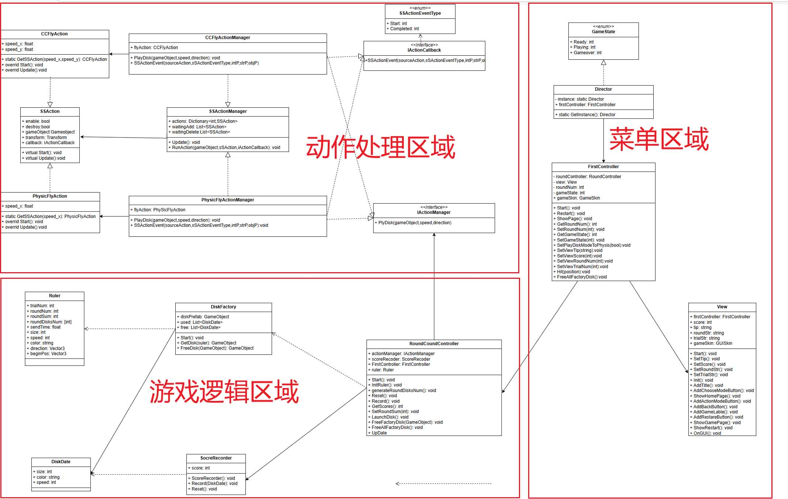
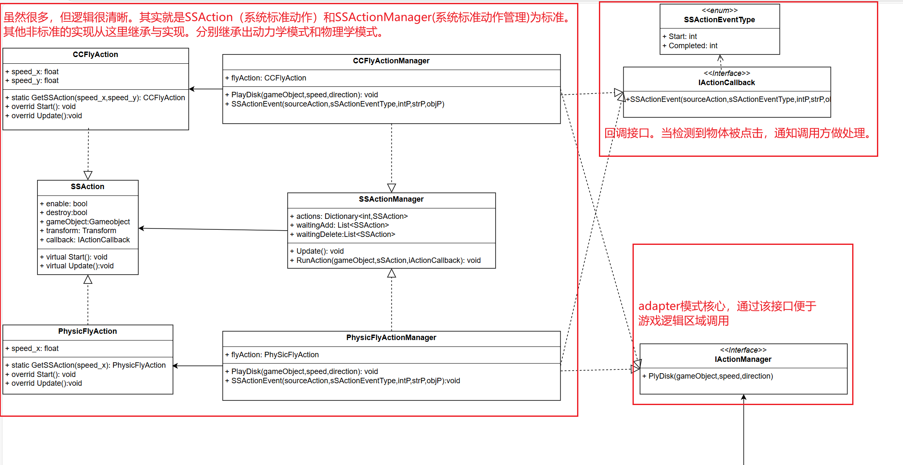
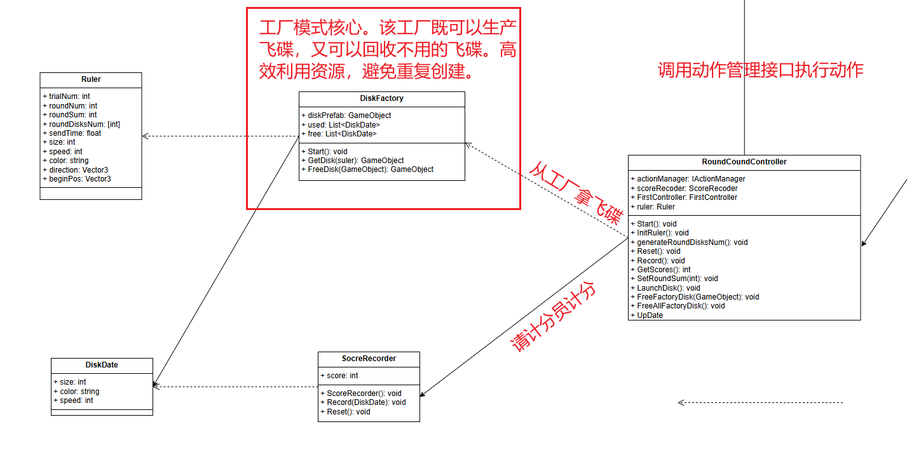
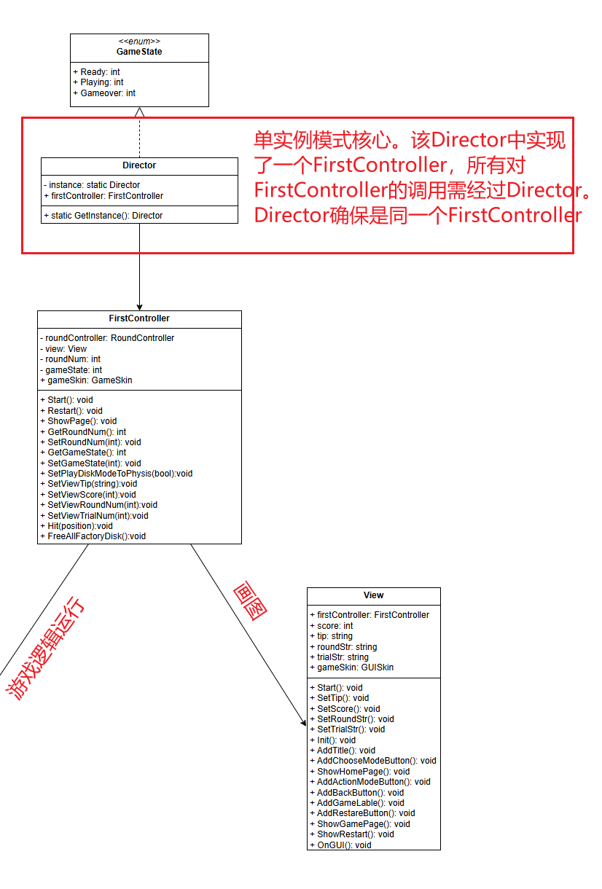

>  一句话描述这个游戏：麻雀虽小，五脏俱全。除了MVC架构，该游戏还涉及到adapter模式、工厂模式、单例模式。

##游戏介绍

​		打飞碟游戏是一款经典的射击类游戏，玩家的主要目标是通过射击飞碟来积累分数，争取获得更高的分数。 游戏中设有多种类型的飞碟，每种飞碟有不同的颜色和分数，玩家需要根据飞碟的特性选择射击目标。 玩家通过点击鼠标模拟射击，成功点击到飞碟时将增加分数。 游戏设有时间限制，玩家需在规定时间内尽可能多地击中飞碟，提升自己的得分。

## 要求
#### 游戏规则
- 游戏有 n 个 round，每个 round 都包括10 次 trial。
- 每个 trial 的飞碟的色彩、大小、发射位置、速度、角度、同时出现的个数都可能不同。它们由该 round 的 ruler 控制。
- 每个 trial 的飞碟有随机性，总体难度随 round 上升。
- 鼠标点中得分，得分规则按色彩、大小、速度不同计算，规则可自由设定。
####实现要求
- 尽可能使用前面==MVC 结构==实现人机交互与游戏模型分离。
- 使用带缓存的==工厂模式==管理不同飞碟的生产与回收，该工厂必须是场景==单实例==的！具体实现见参考资源 Singleton 模板类。
-  按==adapter模式==设计图修改飞碟游戏，使它同时支持物理运动与运动学（变换）运动。

##画UML图

​		上面是大的UML图，我把这张图的内容大致分成3个区域，不同区域之间仅有一个“关系”，也就是菜单会-->游戏逻辑，游戏逻辑-->动作处理。这极大的简化了对这张UML图的理解。（这张图是遵守MVC模式的，因为我觉的这样对区域划分更好理解所以并未严格按照MVC讲解）

#### 动作处理区域

> adapter模式：将一个接口转换为客户端所期待的接口，从而使两个接口不兼容的类可以在一起工作。
>
> 在这张图中，该接口使CCFlyActionManager和PhysicFlyActionManager兼容在一起。

#### 游戏逻辑区域

> 工厂模式：工厂模式（Factory Pattern）是Java中一种常见的设计模式，属于创建型模式的一种。它用于创建对象，但与直接在代码中使用new关键字创建对象不同，工厂模式通过一个共同的接口来创建对象，从而将对象的创建过程与具体的使用客户端代码分离开来。
>
> 在这张图中，DiskFactory作为工厂，既可以生成飞碟，又可以回收飞碟。当然这一切调用者都无需关心，调用者只需要把Ruler（对飞碟的要求）告诉工厂，工厂自会提供合格的飞碟；或者调用者可以把不用的飞碟传给工厂，工厂会回收。

#### 菜单区域

> 单例模式：这种模式涉及到一个单一的类，该类负责创建自己的对象，同时确保只有单个对象被创建。这个类提供了一种访问其唯一的对象的方式，可以直接访问，不需要实例化该类的对象，也就是说不能使用new关键字来创建对象。
>
> 本图使用了模板类来创建单例对象，Director是一个通用的单例模板类，它将确保全局只有一个FirstController。

##代码

#### 动作处理区域

代码

#### 游戏逻辑区域

代码

#### 菜单区域

代码

演示视频：https://www.bilibili.com/video/BV1FMUkYEEDV/?spm_id_from=333.999.0.0

代码仓库：https://github.com/cicada1223/YSU-SSE-3D-/